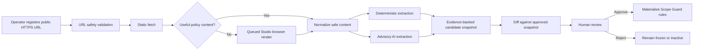

# Public Program Rule URL Intake Design

**Date:** 2026-07-16
**Status:** Approved design; implementation not started

## Summary

Bounty Mythos-Lite will accept one operator-registered, public HTTPS bug-bounty
program rule URL and turn it into an evidence-backed candidate scope snapshot.
The system will fetch the page immediately, refresh it every 24 hours, follow
only explicitly linked same-origin public documents for one hop, and extract
candidate in-scope assets, API references, prohibited actions, automation
rules, and rate limits.

No extracted rule becomes active automatically. The first snapshot and every
changed snapshot require explicit human approval. A policy change freezes real
validation until the replacement snapshot is approved. The intake path may
support offline modeling while frozen, but it never grants execution, expands
scope, bypasses review, or submits reports.

## Goals

- Reduce manual copying of public bounty program rules and scope tables.
- Preserve an auditable source URL and evidence excerpt for every extracted
  field.
- Reuse the existing Scope Guard, policy ingestion, artifact ingestion, and
  Studio browser boundaries.
- Detect program-rule changes within 24 hours and fail closed when the approved
  policy becomes stale.
- Allow explicitly linked same-origin OpenAPI documents to enter the existing
  artifact intake only after the containing scope snapshot is approved.

## Non-goals

V1 does not:

- enumerate programs from HackerOne, Bugcrowd, Intigriti, or another platform;
- fetch authenticated or private program pages;
- persist or reuse browser login state;
- crawl a site beyond explicitly linked same-origin documents at depth one;
- import PDF, archive, executable, or arbitrary attachment formats;
- discover or capture HAR files;
- collect test-account credentials, cookies, tokens, or browser storage;
- automatically approve scope or a validation request;
- automatically attack a target or submit a vulnerability report; or
- provide platform-specific parsers.

HAR import and authenticated test-account sessions remain separate future
subsystems with their own human and redaction gates.

## Confirmed Product Decisions

1. V1 starts from a single program rule URL supplied by the operator.
2. Only public pages that require no login are supported.
3. The first import and every content change require human approval.
4. Real validation freezes while a changed snapshot awaits approval.
5. The fetcher follows only explicit same-origin public links, with depth one.
6. The source refreshes immediately, then every 24 hours, with manual refresh.
7. Extraction uses deterministic parsing plus advisory AI assistance.
8. English rules may receive high-confidence extraction. Other languages keep
   their source evidence and remain `needs_review`.

## Existing Integration Points

The feature extends rather than replaces these project contracts:

- `app.policy_ingestion.parse_policy_text` for conservative policy parsing;
- `app.scope_guard` for final runtime authorization decisions;
- `app.artifact_ingestion` for OpenAPI, Postman, HAR, and policy normalization;
- `app.black_box_hunter.har_intake` for secret-stripped HAR modeling; and
- `apps/studio/black-box-runner.cjs` for ephemeral, request-filtered browser
  execution.

The existing coarse `ProgramRecord` remains a program-level summary. Per-asset
scope rules live in a separate approved-snapshot model.

## Architecture

### Program Rule Intake Coordinator

The API owns source registration, scheduling, fetch-state transitions,
snapshot creation, diff generation, review decisions, and materialization. It
does not perform validation or issue a black-box execution lease.

Only one fetch may run per source. Repeated manual refresh requests coalesce,
and a five-minute manual-refresh cooldown prevents accidental high-frequency
fetching.

### Static Rule Fetcher

The static fetcher is the default path. It retrieves only a validated HTTPS
document with redirects disabled and strict size, content-type, time, and
network limits. It returns response metadata, a content digest, and a bounded
body to the normalizer. The raw body is not written to the database.

### Studio Browser Renderer

The browser renderer is a fallback for public JavaScript-rendered pages. It is
queued only when the static response lacks meaningful rule content. It runs
only while Studio is available and never launches Playwright as a side effect
of normal API startup.

The renderer uses a new unauthenticated ephemeral context, permits only
same-origin `GET` and `HEAD` requests, blocks writes, WebSockets, downloads,
service workers, and third-party egress, extracts bounded visible text and
tables, and destroys the context. If the page cannot render under these
constraints, the source becomes `browser_render_required` or `fetch_failed`;
the system does not relax the network policy.

### Rule Normalizer

The normalizer strips scripts, styles, forms, hidden state, headers, and
browser storage. It produces:

- bounded visible text;
- normalized tables and list items;
- explicit anchor links;
- detected language;
- safe content and structure digests; and
- redacted evidence excerpts capped at 500 characters each.

It never persists complete HTML, response bodies, cookies, authorization
headers, or executable page content.

### Rule Extractor

Deterministic extraction runs first and proposes:

- exact hosts, wildcard hosts, URL prefixes, and API base paths;
- `in_scope`, `out_of_scope`, or `needs_review` status per asset;
- prohibited action classes;
- explicit automation policy;
- explicit rate-limit values and units;
- same-origin linked OpenAPI documents; and
- evidence locations for every proposal.

The advisory AI extractor receives only normalized, bounded public text. It
has no tools, browser, network, execution lease, or mutation capability. It
returns a fixed schema of candidate fields with evidence excerpts. A field is
discarded if its excerpt cannot be matched back to the normalized source.

Deterministic and AI results are merged conservatively. Conflicts, unsupported
languages, missing evidence, ambiguous wildcards, or absent automation/rate
rules remain `needs_review`. AI output can never widen a deterministic
out-of-scope result.

### Snapshot Diff and Review Gate

Every fetch creates or reuses a content-addressed snapshot. An unchanged
content digest produces no new pending review. A changed digest creates a new
pending snapshot and immediately freezes real validation for the program.

The review screen shows added, removed, and modified assets, rules,
prohibitions, rate limits, and linked artifacts beside their evidence. Approval
requires `operator_confirmed=true`. The approval applies only to the scope
snapshot; all validation, lease, review-bypass, scope-change, and report-submit
permissions remain false.

## Network and Fetch Safety

Every initial or linked URL must pass the same checks:

- scheme is exactly `https`;
- no username, password, fragment-dependent resource, or non-public hostname;
- all resolved A and AAAA addresses are globally routable;
- loopback, private, link-local, multicast, unspecified, reserved, and metadata
  addresses are rejected;
- redirects are rejected rather than followed;
- the connected peer address is checked against the validated resolution;
- DNS and peer checks repeat for every request to resist rebinding;
- linked documents must have the same scheme, hostname, and effective port as
  the registered source;
- only explicit anchor or document links are eligible;
- maximum traversal depth is one;
- at most eight documents and 8 MiB total are fetched;
- each document is at most 2 MiB with a 10-second timeout; and
- accepted media types are HTML, plain text, JSON, and YAML.

The implementation follows the defensive principles in the
[OWASP SSRF Prevention Cheat Sheet](https://cheatsheetseries.owasp.org/cheatsheets/Server_Side_Request_Forgery_Prevention_Cheat_Sheet.html).
Browser interception and redirect-chain inspection use supported
[Playwright network](https://playwright.dev/docs/network) and
[request](https://playwright.dev/docs/api/class-request) APIs.

## Untrusted Content and Prompt Injection

Fetched pages are data, not instructions. Page text cannot select tools,
change prompts outside the extraction schema, start a fetch, approve a
snapshot, create a lease, or alter Scope Guard.

The AI extractor receives an explicit untrusted-content boundary and a closed
output schema. The service validates every output field, evidence excerpt,
asset format, and relationship. Tool calls or additional instructions in model
output are rejected. Model failure does not block deterministic extraction;
it only marks AI assistance unavailable.

## Persistence Model

### `ProgramRuleSourceRecord`

- stable source ID and safe program alias;
- optional program ID after program materialization;
- registered and canonical HTTPS URL;
- refresh interval fixed at 24 hours;
- fetch status, last check, last success, next check, and failure count;
- approved and pending snapshot IDs; and
- created and updated timestamps.

Registering a source creates or retains a program summary with
`scope_status=needs_review` and `automation=needs_review`. It does not create an
in-scope program.

### `ProgramRuleSnapshotRecord`

- immutable source and normalized-content digests;
- fetch timestamp, fetch mode, content type, and detected language;
- structured candidate extraction;
- bounded redacted evidence excerpts;
- explicit linked-document metadata;
- review status, reviewer alias, review timestamp, and review digest; and
- fixed-false permission fields.

Raw HTML and browser state are not persisted.

### `ProgramScopeRuleRecord`

- program ID, approved snapshot ID, and source evidence reference;
- one normalized asset per record;
- scope status, automation status, allowed validation classes, prohibited
  classes, and structured rate limit; and
- immutable approval digest and effective timestamp.

Only rules from the current approved snapshot are effective. Historical rules
remain queryable for audit but cannot authorize new work.

## Orthogonal State Model

The design avoids one overloaded status field:

- fetch status: `scheduled`, `fetching`, `ok`, `browser_render_required`, or
  `failed`;
- snapshot review status: `pending`, `approved`, or `rejected`; and
- effective scope status: `needs_review`, `active`, or `frozen`.

A source may therefore be `failed` while its last approved scope remains
temporarily active, or `ok` while a changed snapshot keeps effective scope
frozen.

## Refresh and Failure Rules

- Registration triggers an immediate fetch.
- Successful sources refresh every 24 hours.
- Manual refresh is available subject to coalescing and cooldown.
- An unchanged snapshot leaves the approved scope active.
- A changed snapshot freezes real validation immediately.
- One transient fetch failure keeps the approved snapshot active and raises a
  warning.
- If no successful check occurs for 72 hours, effective scope becomes frozen.
- A rejected replacement leaves the program frozen until a later snapshot is
  explicitly approved or the operator explicitly retires the source.
- Offline modeling may continue from approved artifacts while frozen, but all
  validation and execution decisions fail closed.

## API Surface

The minimal API surface is:

- register and list program rule sources;
- get one source and its current state;
- request a manual refresh;
- list source snapshots;
- view a pending-versus-approved snapshot diff;
- approve or reject a snapshot with operator confirmation; and
- list the current effective per-asset program scope rules.

All responses that include a snapshot or rule also return
`execution_allowed=false`, `lease_grant_allowed=false`,
`scope_change_allowed=false`, `review_bypass_allowed=false`, and
`report_submission_allowed=false`.

## Studio Workflow

Studio adds a small program-rule intake surface rather than a new dashboard:

1. Enter a safe program alias and public rule URL.
2. Observe static-fetch or browser-render status.
3. Review extracted fields and source evidence.
4. Compare changed fields against the approved snapshot.
5. Approve or reject the entire snapshot.
6. See active, pending-review, stale, and frozen state clearly.

The UI never displays or accepts account passwords, cookies, tokens, raw HAR,
or authorization headers.

## OpenAPI Link Handling

An OpenAPI document is eligible only when it is explicitly linked from the
registered page or another eligible depth-one document, remains same-origin,
passes the network checks, and has an accepted JSON or YAML media type.

Before snapshot approval, only link metadata and a safe digest appear in the
pending snapshot. After approval, the document may enter the existing artifact
normalizer with the program ID, snapshot ID, URL digest, and evidence
provenance. The artifact remains research input and grants no validation
permission.

## Testing Strategy

### Unit tests

- URL parser and scheme/userinfo validation;
- IPv4 and IPv6 public/private/link-local/reserved classification;
- DNS rebinding and connected-peer mismatch simulations;
- redirect rejection;
- content-type, per-document, aggregate-size, depth, count, and timeout limits;
- same-origin link selection and third-party link rejection;
- HTML/table/list normalization and secret redaction;
- deterministic extraction of in-scope, out-of-scope, wildcard, prohibited,
  automation, rate-limit, and OpenAPI rules;
- evidence back-reference validation;
- unsupported-language and parser-conflict handling; and
- prompt-injection strings treated as inert page data.

### Browser tests

- fresh context per render and guaranteed teardown;
- no persistent profile or storage-state output;
- non-GET/HEAD, cross-origin, WebSocket, download, and service-worker blocking;
- redirect-chain rejection;
- no HAR, cookies, headers, bodies, or concrete credentials in results; and
- failure remains closed when required page content depends on blocked egress.

### Repository and API integration tests

- registration creates `needs_review`, never `in_scope`;
- first snapshot requires operator confirmation;
- unchanged refresh reuses the approved snapshot;
- changed refresh freezes validation;
- rejection cannot reactivate the old rule silently;
- a transient failure warns without fabricating change;
- 72-hour staleness freezes the program;
- approval materializes only evidence-backed per-asset rules;
- approved OpenAPI links enter artifact ingestion with provenance;
- snapshot approval cannot be reused as validation approval; and
- migrations upgrade and adopt supported persistent databases safely.

### End-to-end and regression tests

- local deterministic HTTPS fixtures cover static HTML, tables, JSON/YAML,
  JavaScript rendering, wildcard scope, exclusions, rate limits, and policy
  changes;
- CI makes no request to a real bounty platform;
- every accepted field in the fixture corpus has an evidence reference;
- zero fixture may promote scope without operator confirmation;
- existing Scope Guard, HAR redaction, black-box audit, Studio, backend, Web,
  and Compose gates remain green; and
- no persisted record contains secrets, tokens, cookies, authorization values,
  raw HTML, or browser storage.

## Acceptance Criteria

V1 is complete only when:

1. A public English rule URL can produce a pending, evidence-backed candidate
   snapshot through static fetch or bounded Studio rendering.
2. Explicit same-origin depth-one rule/OpenAPI links are handled within all
   network budgets.
3. First import, changed policy, and stale policy cannot authorize validation
   without explicit human review.
4. Every effective scope field is traceable to an approved snapshot and source
   excerpt.
5. Unknown, ambiguous, conflicting, unsupported-language, and missing-rate
   cases remain `needs_review`.
6. SSRF, redirect, DNS-rebinding, prompt-injection, secret-persistence, and
   browser-egress hard-failure tests pass.
7. No new path grants execution, a lease, scope expansion, review bypass, or
   report submission.
8. The full existing verification suite remains green.

## Final Scope Boundary

This V1 automates public policy intake, not target discovery or exploitation.
The operator still selects the program URL, approves the resulting scope, uses
only authorized test assets and accounts, approves any later validation, and
submits reports manually.
