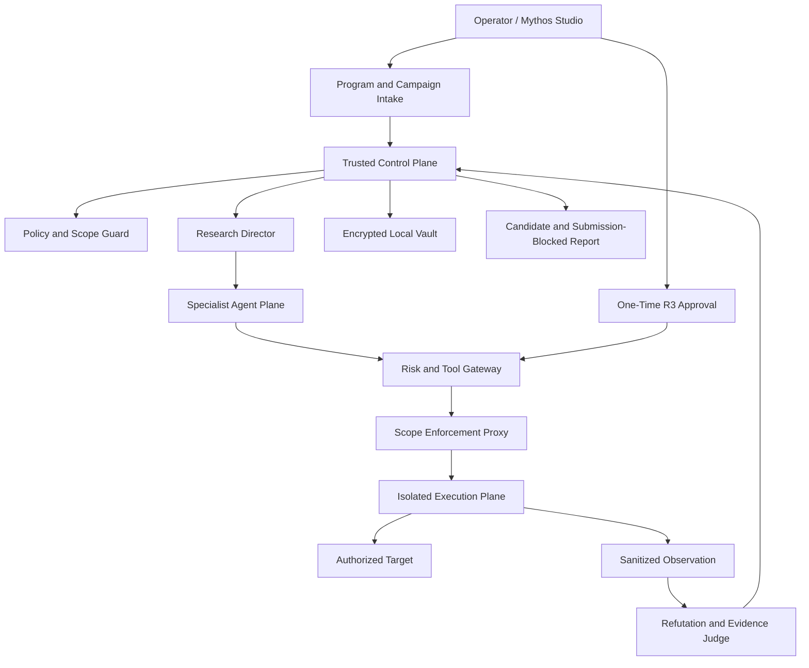

# Mythos Bounty Autopilot Design

**Date:** 2026-07-24
**Status:** Approved design; implementation not started

## Summary

Bounty Mythos-Lite will evolve into a local-first, Strix-inspired autonomous
bug-bounty research product. An operator supplies a public program-rules URL,
a seed target, at least two owned test accounts, and a campaign budget. Mythos
then continuously maps the authorized target, builds authorization and
workflow models, generates and refutes vulnerability hypotheses, performs
pre-authorized low-risk validation, and produces a submission-blocked report
draft with a complete audit trail.

The product is not a Strix fork. Mythos owns the policy, scope, campaign,
evidence, approval, and reporting truth. Strix-compatible or similar workers
may later run as isolated tool workers, but they never become the control
plane or a source of authority.

The central product decision is:

> One explicit Campaign authorization permits bounded R0-R2 research described
> by the approved policy, scope, accounts, recipes, and budgets. R3 operations
> require a separate, one-time, plan-bound approval. R4 operations are always
> prohibited.

Campaign authorization is human authorization, not a bypass around it. The
system may automate only the exact low-risk classes the operator approved for
that Campaign.

## Product Goal

The first product milestone is a maximum-automation, black-box bounty mode for
authorization and business-logic research:

```text
public program rules + seed target + owned test accounts
-> approved scope and campaign authorization
-> continuous asset and application mapping
-> account / role / object / workflow model
-> ranked vulnerability hypotheses
-> bounded R0-R2 validation
-> independent refutation and evidence judgment
-> sanitized candidate and report draft
-> human review and manual submission
```

V1 prioritizes these vulnerability families:

1. Broken Object Level Authorization and IDOR.
2. Broken Function Level Authorization.
3. Object property authorization and mass assignment.
4. Account registration, binding, recovery, and session workflows.
5. Business-state and workflow transition bypass.
6. GraphQL query, mutation, and resolver authorization.

Existing code, API, HAR, and local Candidate Hunter capabilities remain useful
inputs, but source-code audit is not on the critical path for this black-box
Autopilot milestone.

## Success Criteria

The design is successful when all of the following are true:

- An authorized lab campaign completes the full loop from rule intake to a
  sanitized, submission-blocked report draft without manual steering.
- The same architecture produces at least one candidate on a real, explicitly
  authorized bounty program that is strong enough for the operator to consider
  manual submission.
- Every outbound request has a valid Campaign, scope snapshot, risk decision,
  execution lease, request budget, and audit record.
- A process or host restart resumes the Campaign without duplicate state
  changes, duplicate approval consumption, or lost evidence lineage.
- Scope escapes, unauthorized R3 execution, R4 execution, retained real-user
  data, credential leakage, and automatic report submission remain zero.

An accepted bounty is not a V1 release requirement. Candidate quality,
reproducibility, and safe operation are the first proof points.

## Non-goals

V1 does not:

- fully automate report submission;
- promote an observation or model claim directly to a confirmed vulnerability;
- perform denial of service, credential attacks, social engineering,
  destructive testing, persistence, or unbounded scanning;
- collect or enumerate third-party user data;
- automate CAPTCHA, phone verification, payment, or other identity challenges;
- rotate proxies or increase traffic in response to a WAF;
- make advanced request smuggling, desynchronization, or cache-poisoning tests
  low-risk operations;
- train a foundation model;
- replace the existing local code-audit product path; or
- reproduce every Strix feature before the core research loop works.

## Relationship to Current Safety Policy

This document specifies a target product architecture. It does not itself grant
the current runtime permission to perform new live operations.

The repository's current `AGENTS.md` safety boundaries remain authoritative
until they are changed in a separate, explicit, reviewed policy migration.
In particular, automated live R1-R2 validation against public bounty assets
must not ship merely because this design has been approved. It requires:

1. a separate approval of the exact operational policy change;
2. a green existing test baseline;
3. successful lab acceptance;
4. enforcement-proxy and secret/data-retention review; and
5. a bounded field-pilot authorization.

This separation prevents a product design document from silently becoming an
execution permission.

## Product Modes

### Bounty Autopilot

The operator approves a Campaign built from a public program policy, explicit
scope snapshot, owned test accounts, permitted validation recipes, and hard
budgets. Mythos may then run approved R0-R2 work without asking for each
individual low-risk action. R3 work pauses for one-time approval.

### Lab

Lab mode targets a local or operator-controlled environment. It is the first
release and regression environment for every validation recipe. It uses the
same policy, risk, lease, evidence, and reporting controls as Bounty Autopilot.

### Code and Artifact Audit

The existing authorized local code, API, and HAR workflows continue to operate.
Their facts may seed or refute black-box hypotheses, but they remain a separate
intake path rather than a requirement for Autopilot.

## Confirmed Product Decisions

1. Mythos evolves natively instead of forking Strix.
2. The product is local-first and runs through Mythos Studio on Windows.
3. Docker or WSL provides isolated browser, proxy, shell, and tool execution.
4. V1 begins from a public program-rules URL and one seed target.
5. A Campaign is persistent and continuously revisits authorized target
   changes instead of acting as a one-shot scan.
6. At least two operator-owned test accounts are required for authorization
   differential research.
7. Additional test accounts may be registered automatically only when the
   program allows automation and registration requires no CAPTCHA, phone,
   payment, or third-party identity.
8. Explicit wildcard scope permits automatic asset discovery, but admission is
   deterministic and fail-closed.
9. Low-risk reversible actions involving only owned accounts may run under the
   Campaign authorization and its budgets.
10. High-risk operations require a one-time approval bound to the exact plan.
11. A WAF block parks or redirects one research branch; it does not terminate
    the entire Campaign.
12. Suspected real-user data stops that data branch immediately. Mythos
    discards the content and switches to an owned-account or canary proof.
13. Reports remain submission-blocked and require human review and submission.

## Architecture and Trust Boundaries



### Trusted control plane

FastAPI, PostgreSQL, and Mythos Studio form the source of truth for:

- programs, rules, scope snapshots, and exclusions;
- Campaign authorization and budgets;
- test-account aliases and vault handles;
- hypotheses, validation plans, and risk decisions;
- execution leases and tool-run status;
- sanitized observations and evidence lineage;
- refutation, candidate, and report state; and
- immutable audit events.

Neither an agent nor an execution container may create permission by writing a
status field. Permission is derived by the control plane from approved,
persisted records.

### Untrusted agent plane

Agents may interpret facts, propose hypotheses, choose an approved Skill,
request a validation plan, and recommend a next branch. Their output is
untrusted structured advice. Agents receive:

- scoped application facts;
- account, role, and object aliases;
- redacted observations;
- recipe schemas and remaining budgets; and
- stable evidence references.

They do not receive raw credentials, cookies, authorization headers, vault
keys, Docker access, or unrestricted network and shell tools.

### Isolated execution plane

Every browser, proxy, HTTP replay, scanner, shell, or proof action runs through
an execution lease issued by the trusted control plane. Execution containers
cannot bypass the Scope Enforcement Proxy and cannot reach the control-plane
database or the host Docker socket.

### Optional Strix-style worker

A future Strix-compatible worker may expose browser, proxy, shell, security
Skill, and agent-graph capabilities behind the same Tool Gateway. It is treated
as untrusted execution infrastructure. It cannot:

- approve or widen scope;
- read raw vault secrets directly;
- choose its own risk tier;
- issue or extend a lease;
- promote evidence;
- mark a finding confirmed; or
- submit a report.

## Program and Campaign Intake

Campaign creation asks for only the information needed to authorize useful
work:

- a public HTTPS program-rules URL;
- one seed target;
- at least two owned test accounts or a supported account-setup flow;
- total request, time, concurrency, and model-cost budgets;
- schedule and active hours; and
- an emergency-stop preference.

The rules intake extracts candidate assets, wildcard boundaries, exclusions,
prohibited tests, automation restrictions, explicit rate limits, account
requirements, and data-handling rules. Deterministic parsing runs first;
advisory model extraction must cite source excerpts.

The operator reviews and approves the initial normalized policy and scope
snapshot once. The Campaign authorization binds to that immutable snapshot. A
material source change creates a replacement snapshot and freezes new active
validation until the operator approves it. Passive comparison and local
reasoning may continue while frozen.

## Scope Admission

An asset discovered beneath an explicitly approved wildcard can enter the
Campaign automatically only when all deterministic gates pass:

1. the normalized hostname matches the approved wildcard;
2. no exact, wildcard, path, port, or environment exclusion applies;
3. the program policy permits the proposed automation class;
4. DNS, CNAME, resolved-address, and redirect checks do not leave the approved
   trust boundary;
5. the destination is not a private, loopback, link-local, metadata, or
   otherwise protected address unless the approved lab scope explicitly says
   it is;
6. the scheme and port are allowed;
7. the asset has not exceeded per-asset discovery or request budgets; and
8. the current scope snapshot remains approved and unexpired.

An ambiguity produces `needs_scope_review`; it never produces an implicit
allow. A discovered asset receives its own stable identity and provenance
before any active request.

The proxy repeats scope evaluation before every request and every redirect.
Admission at discovery time is not a permanent network capability.

## Risk and Authorization Model

### R0 — passive

Examples include local rule parsing, previously captured artifact analysis,
certificate transparency data already acquired through an approved provider,
DNS metadata, public documentation interpretation, and offline hypothesis
generation.

R0 may run automatically in an active Campaign.

### R1 — active read-only

Examples include bounded `GET`, `HEAD`, or `OPTIONS` requests, browser mapping,
technology identification, endpoint discovery from served application
resources, and read-only comparison of owned-account views.

R1 may run automatically only when the approved Campaign explicitly permits
the recipe, target, method class, rate, and budget.

### R2 — reversible owned-account validation

R2 covers a narrowly defined, non-destructive validation recipe that may
change state only in operator-owned test accounts or use an operator-controlled
canary. Examples at the policy level include:

- two-owned-account authorization differentials;
- a harmless marker rendered only in owned-account content;
- an operator-controlled callback canary;
- bounded read-only input-handling probes; and
- reversible workflow transitions with a declared rollback.

Each R2 recipe must have lab tests, typed inputs, a mutation inventory,
rollback behavior, stop conditions, and a strict request ceiling. Campaign
authorization names the exact recipe set. A model cannot invent a new R2
recipe at runtime.

### R3 — high risk and separately approved

R3 includes operations whose protocol ambiguity, cross-user impact, shared
cache impact, or difficult rollback makes Campaign-level authorization
insufficient. Advanced request smuggling, desynchronization, cache poisoning,
and any novel validation recipe default to R3.

R3 produces an approval card in Studio and waits. Approval is:

- bound to one Campaign, target, scope snapshot, hypothesis, and plan digest;
- limited to exact methods, payload class, account aliases, and tool;
- limited by request count, concurrency, duration, and response size;
- short-lived and single-use;
- invalid after scope or plan change; and
- consumed atomically when the lease is issued.

### R4 — prohibited

R4 cannot be approved. It includes:

- denial of service or resource exhaustion;
- credential stuffing, password spraying, or account takeover attempts against
  accounts not owned by the operator;
- social engineering;
- destructive deletion or irreversible business transactions;
- malware, persistence, or intentionally harmful payloads;
- bypassing Scope Guard, the Tool Gateway, the enforcement proxy, redaction,
  evidence review, or report gates;
- intentional collection or enumeration of real-user data;
- secret, credential, token, cookie, or authorization-header retention; and
- automatic report submission.

## Plan and Lease Contract

Every active operation is represented by a canonical, immutable plan. At
minimum it binds:

- `campaign_id`;
- `scope_snapshot_id`;
- `asset_id` and resolved destination identity;
- `hypothesis_id`;
- owned-account aliases or canary identity;
- risk tier and approved recipe version;
- HTTP methods and mutation inventory;
- request, concurrency, response-size, duration, and cost budgets;
- rollback and cleanup contract;
- stop conditions;
- tool and container profile;
- plan digest; and
- approval reference when R3.

The Tool Gateway validates the plan and reserves its budget before issuing a
short-lived execution lease. The lease cannot exceed the plan. Each use is
atomically recorded, and completion or expiry revokes the remaining
capability.

Client-provided fields such as `allowed_to_execute` are never authoritative.

## Autonomous Research Runtime

The Research Director advances a persistent Campaign through this bounded
cycle:

```text
refresh rules and scope
-> discover and admit assets
-> map browser routes and traffic
-> model accounts, roles, objects, and workflows
-> generate hypotheses
-> select approved Skills and recipes
-> classify risk
-> execute authorized R0-R2 work or queue R3 approval
-> sanitize observation
-> refute and judge evidence
-> retain, park, or close candidate
-> update report draft and research queue
-> choose the next highest-value branch
```

The first specialist set is deliberately small:

- **Campaign Coordinator:** refreshes policy, budgets, due work, and lifecycle.
- **Research Director:** chooses the next bounded branch from persisted facts.
- **Recon Agent:** maps approved assets and application entry points.
- **Browser Mapper:** records safe routes, forms, actions, and traffic shape.
- **Session Broker:** manages owned-account sessions through opaque handles.
- **Authorization Agent:** models subjects, objects, operations, and ownership.
- **Workflow Agent:** models state transitions and business invariants.
- **Skill Router:** selects only approved, versioned research recipes.
- **Refutation Agent:** actively searches for controls and benign explanations.
- **Evidence Judge:** grades only cited observations and contradictions.
- **Report Agent:** maintains a sanitized, submission-blocked draft.

The runtime does not implement free-form multi-agent conversation as its state
machine. Durable records are authoritative:

```text
Signal
-> Hypothesis
-> Validation Plan
-> Risk Decision
-> Execution Lease
-> Tool Run
-> Sanitized Observation
-> Evidence Claim
-> Refutation
-> Candidate Decision
-> Report Revision
```

Each record references its predecessors, policy and recipe versions, timestamps,
and stable digests. Retries reuse idempotency keys and may not duplicate state
changes or approval consumption.

## Scheduling, Budgets, and Recovery

A Campaign may run continuously while Mythos Studio is closed. The local
control-plane service schedules due work from PostgreSQL. Studio is required
only for initial authorization, R3 approval, CAPTCHA or other human takeover,
policy-change review, candidate confirmation, and report submission.

Every level is bounded:

- Campaign-wide request, time, model-cost, and active-hour budgets;
- per-asset and per-account budgets;
- per-hypothesis tool-call and retry budgets;
- per-recipe method, request, concurrency, and response limits;
- global and target-specific rate ceilings; and
- a hard emergency stop that revokes active leases.

One durable state transition is committed before dependent work is dispatched.
On restart, the scheduler reconstructs pending work from persisted state. A
stale in-flight lease expires; an idempotent read may be retried, while a
potential mutation requires proof of outcome or human review before retry.

A Campaign finishes a source snapshot when no eligible branch remains. Later
policy, asset, application, or operator changes create new signals and wake it
without rewriting prior history.

## Local Execution Plane

### Campaign Research Pod

Each active Campaign has an isolated research pod containing:

- ephemeral browser profiles for owned accounts;
- an intercepting proxy;
- short-lived session handles;
- bounded event streams; and
- references to sanitized artifacts.

Raw traffic bodies are processed inside the pod and are not copied into
general Campaign logs.

### Ephemeral tool containers

Shell, scanners, parsers, replay tools, and proof recipes run in short-lived
containers with:

- a non-root user;
- read-only root filesystem;
- an explicit temporary working directory;
- CPU, memory, process, time, and output limits;
- no host Docker socket;
- no control-plane database access;
- no direct arbitrary network route; and
- destruction after the Tool Run.

### Scope Enforcement Proxy

All target traffic, including browser and tool traffic, passes through one
enforcement proxy. Before sending each request it checks:

- effective approved scope;
- hostname, DNS, CNAME, resolved IP, scheme, port, and redirect destination;
- method and mutation class;
- recipe, plan, lease, and remaining request budget;
- per-target rate and concurrency;
- response-size allowance; and
- Campaign stop state.

The proxy fails closed. Tools cannot request an exception.

### Initial tool surface

The execution plane may expose these bounded capabilities:

- Playwright browser navigation and owned-account workflow recording;
- intercepting-proxy metadata and sanitized request templates;
- HTTP replay and differential comparison;
- approved DNS and asset-discovery adapters;
- technology and served-resource endpoint extraction;
- GraphQL schema and operation mapping when exposed in scope;
- sandboxed shell commands from a fixed allowlist;
- screenshots, redacted DOM projections, and sanitized traffic artifacts; and
- a self-hosted, operator-controlled callback canary.

Adding a tool does not add permission. Every tool call still requires an
approved recipe and lease.

## Account, Credential, and Session Handling

The operator supplies at least two owned test accounts. Secrets are encrypted
in a local vault. Agents and general logs see only account aliases such as
`owner_a`, `owner_b`, and role labels.

The Session Broker:

1. obtains a narrow secret handle from the vault;
2. establishes or refreshes the session inside the isolated browser pod;
3. exposes only an opaque session handle to approved tools;
4. prevents cookie, token, password, and authorization-header values from
   reaching prompts or persisted observations; and
5. destroys or revokes the session when the Campaign or pod ends.

Automatic account registration is allowed only when the approved program rules
permit it, the account belongs to the operator, and no CAPTCHA, phone, payment,
or third-party identity step is required. Otherwise the Campaign requests
human takeover.

## WAF, Rate-Limit, and Anti-Automation Handling

A WAF response is an observation, not a vulnerability and not a Campaign-wide
stop condition.

When a branch encounters a likely WAF block:

1. record safe response metadata and the affected plan step;
2. check the program's automation and rate rules again;
3. allow only a small, recipe-defined number of semantically equivalent
   low-risk variants within the existing budget;
4. never increase frequency, rotate source identity, or use an unapproved
   evasion technique;
5. park the branch after repeated blocks; and
6. continue independent research branches.

A genuine rate-limit warning, CAPTCHA, account lock signal, policy prohibition,
or request-budget exhaustion stops the affected active work immediately. The
Campaign may continue only on unrelated branches that remain allowed.

## Suspected Real-User Data Handling

Encountering suspected third-party data may indicate a serious authorization
problem, but it does not authorize further collection.

The mandatory handling path is:

```text
detect suspected third-party data in memory
-> stop the data-bearing branch
-> do not enumerate, paginate, expand, or repeat for more data
-> discard the response content
-> persist only non-content safety metadata
-> switch to owned-account or operator-canary reproduction
-> continue unrelated safe branches
```

Safe metadata may include the Tool Run ID, affected endpoint identity, stop
reason, timestamp, status class, and the fact that redaction and discard
completed. It must not include body samples, values, screenshots, DOM content,
raw headers, or reversible content fingerprints.

The report may state that suspected third-party data triggered the stop rule,
but it may not contain that data, even in nominally redacted form. The evidence
goal becomes a deterministic two-owned-account or canary differential. If that
proof cannot be obtained, the candidate remains unconfirmed and explicitly
records the evidence gap.

Intentional collection remains R4 even when the operator proposes not to save
the data.

## Evidence, Refutation, and Candidate State

Mythos distinguishes claims from observations:

| Level | Meaning |
| --- | --- |
| L0 | Model speculation or ungrounded hypothesis |
| L1 | Imported but unverified claim |
| L2 | Deterministic static or mapping observation |
| L3 | Sanitized dynamic observation from an authorized Tool Run |
| L4 | Human-reviewed evidence |
| L5 | Human-confirmed finding |

An agent, scanner, differential response, or automated judge cannot create L4
or L5.

For every hypothesis, the Refutation Agent checks at least:

- global, gateway, or middleware authorization controls;
- public-by-design data or operations;
- self-only impact;
- role, tenant, ownership, and workflow preconditions;
- expected business behavior;
- stale session or caching artifacts;
- out-of-scope or prohibited validation;
- duplicate root causes; and
- missing reproducibility or impact evidence.

The Evidence Judge reads only structured claims, cited observations,
contradictions, provenance, and policy state. It returns:

- `refuted`;
- `insufficient_evidence`;
- `retained_candidate`;
- `needs_human_review`; or
- `blocked_by_policy`.

It does not return `confirmed`.

A retained candidate binds the affected asset, action, subject/object
differential, root-cause hypothesis, evidence references, refutation results,
scope decision, remaining gaps, and safe reproduction plan.

## Report Contract

The Report Agent incrementally builds:

- a conservative title and summary;
- affected asset and operation;
- owned-account prerequisites;
- minimal sanitized reproduction steps;
- expected and actual behavior;
- authorization or workflow invariant;
- technical and business impact;
- evidence and refutation ledger;
- scope and policy compliance;
- test boundaries and stop events;
- remediation guidance; and
- audit timeline.

Every draft has `submission_blocked=true`, visible evidence grade, and missing
evidence markers. Human review is required to confirm the finding, adjust
impact, and submit it outside the automatic system.

Duplicate search may rank similarity and display prior candidates, but it may
not silently discard a candidate without a recorded decision.

## Mythos Studio Experience

### Campaign creation

Studio presents the program-rules URL, seed target, owned test accounts,
budgets, schedule, normalized policy, scope diff, allowed recipe set, and
Campaign authorization in one guided flow.

### Live research workspace

The primary Campaign screen contains:

- **Agent Graph:** active specialist, dependencies, and handoffs;
- **Asset Map:** discovered, admitted, parked, and review-required assets;
- **Live Timeline:** plans, leases, Tool Runs, observations, and decisions;
- **Research Queue:** ranked branches and why each is next;
- **Budget Monitor:** remaining requests, time, accounts, and model cost;
- **Approval Inbox:** exact R3 plan diff and one-time approval;
- **Steering:** bounded priority or hypothesis guidance; and
- **Emergency Stop:** immediate lease revocation and Campaign pause.

Steering changes priority, not scope or risk.

### Candidate workspace

Each candidate shows:

- affected asset and action;
- two-account or canary differential;
- sanitized proof and evidence grade;
- supporting and contradicting facts;
- Refutation Agent output;
- Evidence Judge basis;
- scope, policy, recipe, and audit lineage;
- reproducibility and remaining gaps;
- remediation guidance; and
- the submission-blocked report draft.

### Headless operation

A local API or CLI may create, inspect, pause, and resume Campaigns using the
same control-plane services. It cannot bypass initial authorization, R3
approval, CAPTCHA takeover, candidate confirmation, or report submission.

## Failure Handling

The system handles common failures as explicit states:

- **Policy changed:** freeze active validation and request snapshot review.
- **Scope ambiguity:** block the asset before sending a request.
- **Cross-scope redirect:** block before following it and record the reason.
- **Session expired:** ask the Session Broker for bounded re-authentication.
- **CAPTCHA or identity challenge:** pause the account flow for human takeover.
- **WAF block:** use bounded recipe variants, then park only that branch.
- **Suspected third-party data:** discard content, stop the branch, and switch
  to owned-account proof.
- **Container crash:** expire the lease; retry only idempotent work.
- **Uncertain mutation outcome:** do not retry automatically.
- **Budget exhausted:** stop the affected level and preserve resumable state.
- **R3 waiting:** keep independent R0-R2 branches running when safe.
- **Emergency stop:** revoke all active leases and prevent new dispatch.

No failure mode permits a fallback to unrestricted shell, direct networking,
raw data persistence, or relaxed scope.

## Testing Strategy

### Deterministic unit and integration tests

The release suite must cover:

- wildcard admission and every exclusion precedence case;
- DNS, CNAME, IP, port, and redirect scope escapes;
- Campaign authorization binding and scope-snapshot invalidation;
- R0-R2 recipe enforcement;
- R3 expiry, single use, plan mismatch, and atomic consumption;
- unconditional R4 rejection;
- budget reservation and concurrent lease races;
- crash recovery and mutation retry blocking;
- account aliasing and vault isolation;
- prompt, log, observation, and report redaction;
- WAF branch parking without Campaign termination;
- suspected third-party data discard and owned-account fallback;
- report submission blocking; and
- immutable evidence lineage and candidate-state transitions.

### Golden research cases

The authorization/business-logic benchmark includes:

- a true two-account object-authorization failure;
- a route protected by global middleware that must be refuted;
- public data that must not become a disclosure candidate;
- behavior affecting only the same owned account;
- a mass-assignment candidate with and without server-side field filtering;
- a guarded and unguarded workflow transition;
- GraphQL field and resolver authorization cases;
- a WAF-blocked branch with a productive independent branch;
- a suspected third-party-data response that is discarded;
- an out-of-scope redirect blocked before transmission;
- an R3 plan that cannot run before exact approval; and
- an R4 plan that remains impossible to approve.

Every retained candidate must cite actual benchmark observations. Fixture
labels cannot be injected as model context.

### End-to-end acceptance

The lab environment verifies:

1. Campaign creation and initial scope approval.
2. Two-account login through vault-backed session handles.
3. Continuous mapping and hypothesis generation.
4. At least one automated R0-R2 validation recipe.
5. Refutation of a plausible false positive.
6. Retention of a true candidate with sanitized evidence.
7. Crash and restart without duplicate mutation.
8. R3 pause and one-time approval behavior.
9. Emergency-stop lease revocation.
10. Submission-blocked report generation.

The field pilot uses one explicitly authorized program, conservative budgets,
owned test accounts, and operator monitoring. It is not enabled by default.

## Release Gates

No Bounty Autopilot release is acceptable unless:

- the existing backend, Studio, web, and end-to-end suites are green;
- the lab acceptance suite is green;
- scope-escape requests equal zero;
- unauthorized R3 and all R4 executions equal zero;
- retained suspected real-user data equals zero;
- raw credential, cookie, token, and authorization-header leaks equal zero;
- automatic report submissions equal zero;
- duplicate approval consumption and duplicate mutations equal zero; and
- every active Tool Run can be traced to a Campaign authorization, immutable
  plan, risk decision, and lease.

Any regression in these counters fails closed and prevents the affected mode
from starting.

## Delivery Sequence

Implementation proceeds in this order:

1. **Baseline and policy alignment**
   - restore a green current baseline;
   - approve any required change to operational safety policy separately;
   - freeze existing execution and evidence contracts.
2. **Program scope and continuous discovery**
   - finish public-rule intake, snapshot review, wildcard admission, asset
     identity, and continuous refresh.
3. **Execution foundation**
   - implement the enforcement proxy, plan/lease contract, Campaign pod,
     ephemeral containers, vault, and Session Broker.
4. **Authorization and workflow research**
   - ship Browser Mapper, authorization/object model, workflow model, and the
     first versioned R0-R2 recipes.
5. **Evidence quality**
   - integrate Refutation Agent, Evidence Judge, duplicate search, and
     candidate/report contracts.
6. **Continuous product workflow**
   - connect the Research Director, durable scheduler, recovery, Studio live
     workspace, steering, R3 inbox, and emergency stop.
7. **Lab acceptance**
   - run the complete closed loop and all safety fault cases.
8. **Bounded field pilot**
   - authorize one real program, monitor operation, and evaluate whether at
     least one candidate deserves manual submission.

Dashboard completeness, additional vulnerability families, generic agent
marketplaces, and broader tool catalogs remain behind this sequence.

## Final Product Boundary

Mythos Bounty Autopilot is an autonomous research system inside a
human-authorized envelope, not an autonomous exploitation or submission
system.

Its competitive advantage should come from:

- precise program and scope interpretation;
- durable target, account, object, and workflow models;
- high-value hypothesis selection;
- bounded and reproducible validation;
- independent refutation;
- trustworthy, sanitized evidence; and
- a complete operator-visible audit trail.

Models choose and explain research. Deterministic controls authorize it.
Isolated tools observe it. Humans set the envelope, approve high-risk work,
confirm findings, and submit reports.
